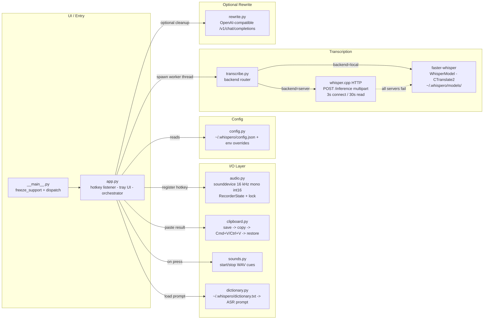
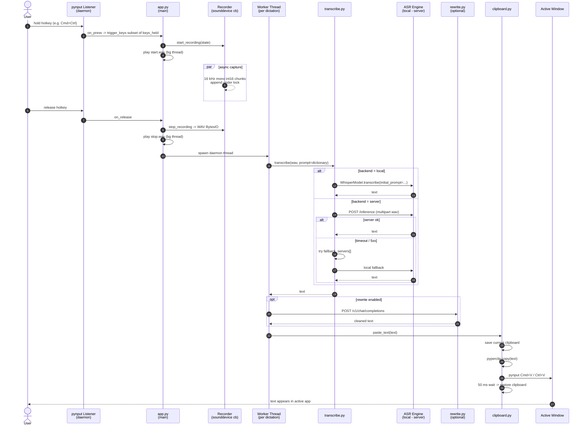
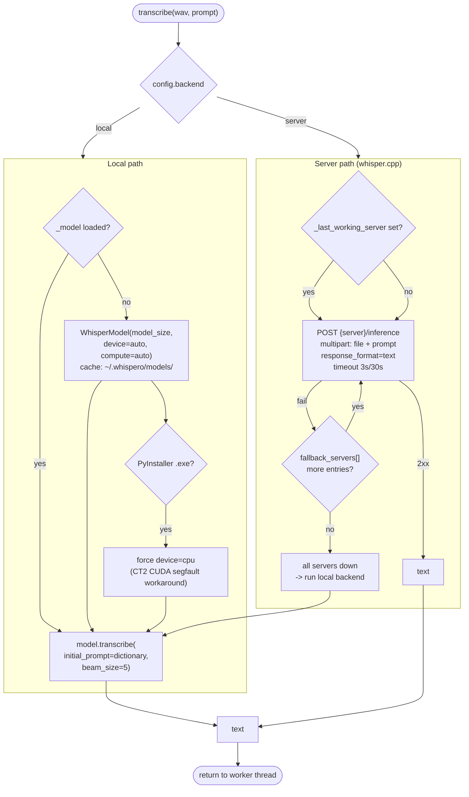

# WhisperO 😮

[](LICENSE)
[](pyproject.toml)
[](https://github.com/SYSTRAN/faster-whisper)

WhisperO is a push-to-talk desktop dictation app.
Hold the hotkey, speak, release, and text is pasted at your cursor.

Local mode is the default. No server is required.
It uses OpenAI's Whisper model for speech recognition, running entirely on your machine.
On first run, WhisperO downloads a speech model to `~/.whispero/models/`.
`large-v3` is the default model and is about 3 GB. Smaller models (`medium`, `small`, `base`, `tiny`) are also available for faster inference on lower-end hardware.

## Features

- **Hold-to-record hotkey** - `Win`+`Ctrl` on Windows, `Cmd`+`Ctrl` on Mac
- **Auto-paste at cursor** without losing clipboard contents
- **Local transcription** with faster-whisper (default), no server needed
- **Optional remote server** via whisper.cpp for multi-machine setups
- **Cross-platform** - macOS, Windows, Linux
- **Custom dictionary** for names and project terms
- **Start/stop sound feedback**
- **System tray** with model switching, dictionary editor, and quick controls


## Quick Start (Local Default)

### One-Line Install

**macOS / Linux:**
```bash
curl -fsSL https://raw.githubusercontent.com/parkercai/whispero/main/setup.sh | bash
```

**Windows (PowerShell):**
```powershell
irm https://raw.githubusercontent.com/parkercai/whispero/main/setup.ps1 | iex
```

The setup script installs Python dependencies and WhisperO in an isolated environment. Run `whispero` when it's done.

### Manual Install

1. **Prerequisites (macOS)**
   ```bash
   brew install python@3.12 portaudio
   ```

2. **Install**
   ```bash
   git clone https://github.com/parkercai/whispero.git
   cd whispero
   pip install .
   ```

   WhisperO works on CPU out of the box. For faster GPU inference on NVIDIA GPUs, install:
   - [CUDA Toolkit 12](https://developer.nvidia.com/cuda-downloads) (includes cuBLAS)
   - [cuDNN 9 for CUDA 12](https://developer.nvidia.com/cudnn)

   Without these, WhisperO still works - just slower.

3. **Run**
   ```bash
   whispero
   ```
   or
   ```bash
   python -m whispero
   ```

That is it. WhisperO starts in local mode and uses model `large-v3`.

4. **Run in background without terminal window (optional)**

   **Windows:**
   ```bash
   pythonw -m whispero
   ```

   To start automatically on login, double-click `scripts\install-startup.bat`.
   To remove: `scripts\uninstall-startup.bat`.

   **macOS:**
   ```bash
   nohup python -m whispero &>/dev/null &
   ```

   For login startup, add WhisperO to System Settings > General > Login Items.

> **macOS permissions:** WhisperO needs Accessibility access (for the hotkey) and Microphone access (for recording). Go to System Settings > Privacy & Security to grant these to your terminal app.

## Advanced: Remote Server

If you want to run transcription on another machine, set server backend:

```bash
export WHISPERO_BACKEND=server
export WHISPERO_SERVER="http://localhost:8080"
```

Server setup guide: [docs/SERVER_SETUP.md](docs/SERVER_SETUP.md)

## Configuration

Config priority:

1. Environment variables
2. `~/.whispero/config.json`
3. Built-in defaults

Supported environment variables:

- `WHISPERO_BACKEND=local|server`
- `WHISPERO_MODEL=large-v3|medium|small|base|tiny`
- `WHISPERO_SERVER=http://host:8080`

Default values:

```json
{
  "backend": "local",
  "server": "http://localhost:8080",
  "model": "large-v3",
  "hotkey": {
    "windows": ["win", "ctrl"],
    "mac": ["cmd", "ctrl"]
  },
  "sounds": true
}
```

Example `~/.whispero/config.json`:

```json
{
  "backend": "local",
  "model": "medium",
  "server": "http://localhost:8080",
  "hotkey": {
    "windows": ["win", "ctrl"],
    "mac": ["cmd", "ctrl"]
  },
  "sounds": true
}
```

Dictionary file location:

- `~/.whispero/dictionary.txt`

## Architecture

WhisperO is a single-process Python desktop app. `app.py` orchestrates a global hotkey listener, a system tray, and per-dictation worker threads. Audio is captured at 16 kHz mono via `sounddevice`. Transcription runs locally (faster-whisper / CTranslate2) by default; optionally it can call out to a `whisper.cpp` HTTP server with automatic fallback to local. The result is pasted into the active window via a save -> copy -> Cmd+V/Ctrl+V -> restore dance so the user's clipboard is preserved.

### 1. Components



### 2. Runtime flow - hotkey -> paste



### 3. Backend routing & fallback



## Benchmarks

Transcription speed for a 5-second audio clip using `large-v3`. Times exclude model loading (warm GPU).

| Hardware | Backend | Median | Avg |
|---|---|---|---|
| RTX 5090 | faster-whisper (local) | 378ms | 390ms |
| NVIDIA GB10 (DGX Spark) | whisper.cpp (server) | 323ms | 375ms |

Run your own benchmark:

```bash
python benchmark.py                    # local mode
python benchmark.py --backend server   # server mode
```

Run the benchmark a few times. The first run warms up GPU memory, so later runs are more accurate.

Got a result? PRs with new hardware numbers are welcome.

## Building Standalone Apps

WhisperO includes a PyInstaller build script.

```bash
pip install -r requirements.txt
python build/build.py
```

Output:

- macOS: `dist/WhisperO.app`
- Windows: `dist/WhisperO/WhisperO.exe`

## Uninstall

```bash
pip uninstall whispero
```

To also remove downloaded models and settings:

```bash
# macOS / Linux
rm -rf ~/.whispero

# Windows
rmdir /s %USERPROFILE%\.whispero
```

## Contributing

PRs are welcome.
Keep behavior stable across both backends.
Please test on your target OS before opening a PR.

## Credits

- [OpenAI Whisper](https://github.com/openai/whisper) - the speech recognition model
- [faster-whisper](https://github.com/SYSTRAN/faster-whisper) - CTranslate2 inference engine
- [whisper.cpp](https://github.com/ggerganov/whisper.cpp) - C/C++ server backend
- [Google Noto Emoji](https://github.com/googlefonts/noto-emoji) - the 😮 icon (Apache 2.0)

## License

MIT. See [LICENSE](LICENSE).
